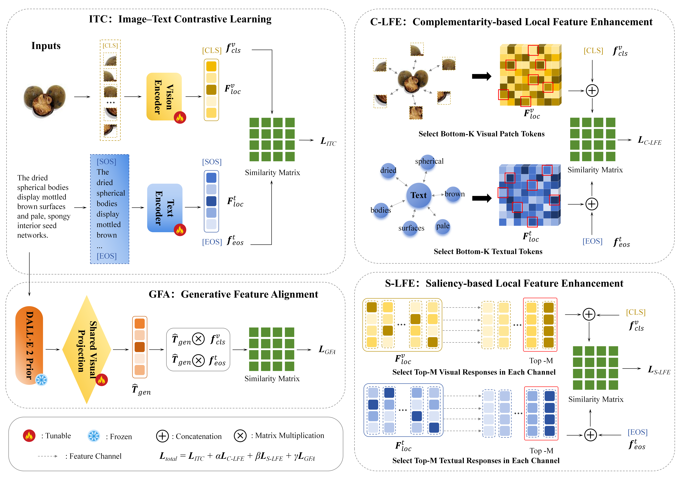

# 🌿 Herb-LEGA

### Local Feature Enhancement and Generative Feature Alignment for Fine-Grained Herbal Image-Text Retrieval

`163 herbal categories · 20,000 images · 60,000 image-text pairs · 2 CLIP backbones`

[Overview](#overview) • [Framework](#framework) • [Results](#results) • [Getting Started](#getting-started) • [Downloads](#downloads) • [Training](#training) • [Evaluation](#evaluation) • [Citation](#citation)


This repository provides the official implementation of **Herb-LEGA**, a CLIP-based dual-encoder framework for fine-grained Chinese herbal medicine image-text retrieval on **Herb163CMR**.

> **Paper:** *Local Feature Enhancement and Generative Alignment for Fine-Grained Chinese Herbal Medicine Image–Text Retrieval*
>
> Herb163CMR pairs each image with three structured morphological descriptions: **Macro Form**, **Inner Structure**, and **Micro-Signs**.
>
> **Code:** [github.com/SimonWang555/Herb-LEGA](https://github.com/SimonWang555/Herb-LEGA)
>
> **Data:** [huggingface.co/datasets/SimonWJ/Herb163CMR](https://huggingface.co/datasets/SimonWJ/Herb163CMR)

<a id="overview"></a>
## 🌟 Overview

Fine-grained herbal image–text retrieval requires distinguishing subtle morphological cues that global representations may overlook. Built on a CLIP dual encoder, Herb-LEGA combines local feature enhancement with generative feature alignment to complement global contrastive learning.

| Component | Role |
| --- | --- |
| **ITC** (Image–Text Contrastive Learning) | Align global image and text representations through a symmetric contrastive objective. |
| **C-LFE** (Complementarity-Based Local Feature Enhancement) | Aggregate the K local tokens least similar to the global representation to capture complementary morphological information. |
| **S-LFE** (Saliency-Based Local Feature Enhancement) | Aggregate the M strongest local responses in each feature channel to emphasize salient morphological cues. |
| **GFA** (Generative Feature Alignment) | Use a frozen DALL-E 2 prior to generate text-conditioned visual features that supervise image–text alignment. |

C-LFE and S-LFE provide complementary local supervision, while GFA promotes cross-modal representation consistency. These auxiliary objectives guide training; retrieval uses cosine similarity between the global image and text embeddings.

<a id="framework"></a>
## 🧩 Framework

<p align="center">
  
</p>

<a id="results"></a>
## 📊 Results on Herb163CMR

Image-to-text and text-to-image retrieval results on Herb163CMR with CLIP ViT-B/16 and ViT-L/14 backbones. All scores are percentages; higher is better.

| Method | Backbone | I2T R@1 | I2T R@5 | I2T R@10 | T2I R@1 | T2I R@5 | T2I R@10 | mR |
| --- | --- | ---: | ---: | ---: | ---: | ---: | ---: | ---: |
| CLIP | ViT-B/16 | 19.27 | 48.90 | 64.17 | 14.23 | 38.34 | 52.27 | 39.53 |
| Herb-LEGA | ViT-B/16 | 23.92 | 53.09 | 71.23 | 17.88 | 44.07 | 57.23 | 44.57 |
| CLIP | ViT-L/14 | 21.15 | 49.95 | 64.10 | 15.69 | 39.14 | 51.64 | 40.28 |
| Herb-LEGA | ViT-L/14 | 24.56 | 56.20 | 71.83 | 18.25 | 44.49 | 57.31 | 45.44 |

mR is the arithmetic mean of the six bidirectional recall scores. The best checkpoint is selected by validation mR.

## 📁 Repository Structure

```text
Herb-LEGA/
├── README.md
├── LICENSE
├── requirements.txt
├── train.py                       # training entry point
├── test.py                        # evaluation entry point
├── model/                         # dual encoder, LFE, GFA, and objectives
│   ├── __init__.py
│   ├── build_model.py
│   ├── build_dalle.py              # frozen prior loader
│   ├── clip_model.py
│   ├── objectives.py
│   └── pooling.py
├── datasets/                      # Herb163CMR parsing and data loaders
├── processor/                     # training and validation
├── solver/                        # optimizer and scheduler
├── utils/                         # options, tokenizer, metrics, checkpoints
├── figures/
│   └── framework.png
├── Herb163CMR/                    # place the downloaded dataset here
├── resources/                     # bundled tokenizer resource
│   └── bpe_simple_vocab_16e6.txt.gz
└── pretrained/
    └── dalle2_prior/              # place the downloaded prior config and checkpoint here
```

Dataset files, pretrained weights, and trained retrieval checkpoints are not bundled with the code.

<a id="getting-started"></a>
## 🚀 Getting Started

### 1. Environment

A CUDA GPU is required. Install the dependencies from `Herb-LEGA/`:

```bash
pip install -r requirements.txt
```

### 2. Dataset Preparation
Place the downloaded dataset files in `Herb-LEGA/Herb163CMR/`.

```text
Herb-LEGA/
└── Herb163CMR/
    ├── Herb163CMR_Descriptions.jsonl
    ├── splits/
    │   └── seed_42/
    │       ├── train.jsonl
    │       ├── validation.jsonl
    │       └── test.jsonl
    └── ... image category directories ...
```

<a id="downloads"></a>
## 📥 Pretrained Model Downloads

Download the following initialization weights before training. The CLIP links match the [OpenAI CLIP model registry](https://github.com/openai/CLIP/blob/main/clip/clip.py); the prior is provided by [LAION DALLE2-PyTorch](https://huggingface.co/laion/DALLE2-PyTorch/tree/main/prior).

| Model | Download | Local location | Purpose |
| --- | --- | --- | --- |
| CLIP ViT-B/16 | [ViT-B-16.pt](https://openaipublic.azureedge.net/clip/models/5806e77cd80f8b59890b7e101eabd078d9fb84e6937f9e85e4ecb61988df416f/ViT-B-16.pt) | `~/.cache/clip/ViT-B-16.pt` | Initialize the B/16 retrieval backbone. |
| CLIP ViT-L/14 | [ViT-L-14.pt](https://openaipublic.azureedge.net/clip/models/b8cca3fd41ae0c99ba7e8951adf17d267cdb84cd88be6f7c2e0eca1737a03836/ViT-L-14.pt) | `~/.cache/clip/ViT-L-14.pt` | Initialize the L/14 retrieval backbone; also used internally by the frozen prior. |
| DALL-E 2 diffusion prior | [best.pth](https://huggingface.co/laion/DALLE2-PyTorch/resolve/main/prior/best.pth?download=true) | `pretrained/dalle2_prior/best.pth` | Frozen GFA prior, shared by both backbone variants. |
| DALL-E 2 prior configuration | [prior_config.json](https://huggingface.co/laion/DALLE2-PyTorch/resolve/main/prior/prior_config.json?download=true) | `pretrained/dalle2_prior/prior_config.json` | Download separately and use with the prior checkpoint. |

Keep the CLIP filenames unchanged when placing them in `~/.cache/clip/`. The existing CLIP loader uses that cache and may download missing CLIP weights. For offline use, prepare both CLIP files in advance, including L/14 for the prior.

### DALL-E 2 Prior Checkpoint

Download `prior_config.json` and `best.pth` from the links above and place them in:

```text
Herb-LEGA/pretrained/dalle2_prior/
├── prior_config.json
└── best.pth
```

Both ViT-B/16 and ViT-L/14 use the same prior.

<a id="training"></a>
## 🏋️ Training

Use the following commands after placing the dataset and pretrained files in the locations above.

### Herb-LEGA with ViT-B/16

```bash
python train.py \
  --name Herb-LEGA_B16 \
  --pretrain_choice 'ViT-B/16' \
  --stride_size 16
```

### Herb-LEGA with ViT-L/14

```bash
python train.py \
  --name Herb-LEGA_L14 \
  --pretrain_choice 'ViT-L/14' \
  --stride_size 14
```

`--name` sets the experiment name, while `--pretrain_choice` and `--stride_size` select the CLIP backbone and patch stride. Training uses the default configuration below.

### Training Configuration

Default settings (overridable via command-line arguments):

| Setting | Value |
| --- | --- |
| Epochs / training batch size | 12 / 48 |
| Optimizer / learning rate | Adam / `1e-5` |
| Learning-rate schedule / seed | Cosine decay / 42 |
| Image size / maximum text length | 224 × 224 / 77 |
| C-LFE K / S-LFE M | 10 / 3 |
| C-LFE / S-LFE / GFA weights | 0.7 / 0.8 / 0.03 |
| Evaluation batch size | 64 |

The checkpoint with the highest validation mR is saved as `best.pth` and evaluated on the test set after training. Training outputs are stored in `outputs/herb163cmr/<timestamp>_<name>/`.

<a id="evaluation"></a>
## 🔎 Evaluation

Use the **trained Herb-LEGA checkpoint matching the selected backbone**. Replace `<timestamp>` below with the training run's timestamp.

### Evaluate ViT-B/16

```bash
python test.py \
  --name Herb-LEGA_B16 \
  --checkpoint "outputs/herb163cmr/<timestamp>_Herb-LEGA_B16/best.pth" \
  --pretrain_choice 'ViT-B/16' \
  --stride_size 16
```

### Evaluate ViT-L/14

```bash
python test.py \
  --name Herb-LEGA_L14 \
  --checkpoint "outputs/herb163cmr/<timestamp>_Herb-LEGA_L14/best.pth" \
  --pretrain_choice 'ViT-L/14' \
  --stride_size 14
```

`--checkpoint` specifies the trained model checkpoint. Evaluation reports image-to-text and text-to-image R@1, R@5, R@10, and their mean (mR), with results saved to `outputs/herb163cmr/<timestamp>_<name>_test/metrics_test_final.json`.

<a id="citation"></a>
## 📝 Citation

If this code or dataset supports your research, please cite:

> *Herb163CMR: LLMs-Assisted Multi-Granularity Morphological Description for Fine-Grained Chinese Herbal Medicine Image–Text Retrieval.*

The manuscript is currently under review. A public paper link and citation information will be added when available.

## 🙏 Acknowledgements

We thank [OpenAI CLIP](https://github.com/openai/CLIP), [DALL-E 2 PyTorch](https://github.com/lucidrains/DALLE2-pytorch), and [LAION](https://huggingface.co/laion/DALLE2-PyTorch) for the pretrained models and supporting implementations.
